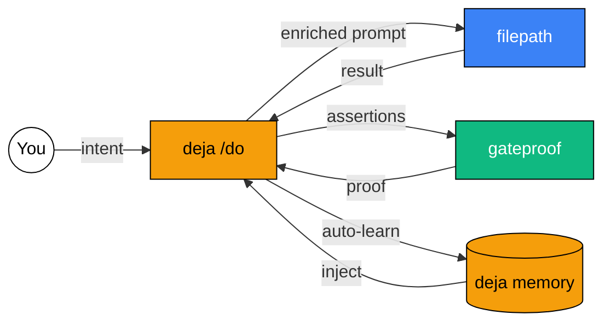

# Memory Interface Explorations

**Research document — how humans (and agents) might interact with deja**

This document explores 20 distinct user experiences for interfacing with persistent memory. They're ordered from conventional to increasingly creative, across three layers:

- **Layer A (1-7):** How people interact with memories in general
- **Layer B (8-13):** Memories tied to a specific agent
- **Layer C (14-20):** Multi-agent, multi-person orchestration — shared pockets of information

Each concept includes a description of the experience, a sketch of how the interaction works, what it reveals that other interfaces don't, and how it connects to deja's existing primitives (`learn`, `inject`, `query`, scopes, working state, confidence, embeddings).

---

## Layer A: Human Memory Interaction Patterns

### 1. The Filing Cabinet

**What it is:** A searchable, filterable table of all learnings. Columns for trigger, learning, confidence, scope, date. Sort, filter, bulk-select, delete. The spreadsheet of memory.

**How you interact:** You open a dashboard. You see rows. You search with a text box. You click column headers to sort. You might group-by scope. You select rows and hit delete. You can inline-edit a trigger or learning. There's a CSV export button.

**What it reveals:** Everything, in the most literal sense. No learning is hidden. But nothing is connected. Every memory is an island in a row. This is how most developer tools approach data — and it's useful exactly once (the first time you need to audit what's actually in there).

**Where it fits deja:** Maps directly to `/learnings` with scope filters. Could be built in an afternoon. This is the "we need admin tooling" interface — not the product interface.

**Why it's limited:** Memory isn't tabular. The reason a learning exists matters more than its content. The filing cabinet shows you _what_ without _why_ or _when it mattered_.

---

### 2. The Journal

**What it is:** A chronological, scrollable timeline. Each entry is a moment — a learning was stored, a memory was recalled, a state was resolved. Time flows downward. Entries cluster by day or by run.

**How you interact:** You scroll through time. You see natural clusters: "Tuesday afternoon — 4 learnings from the deploy debugging session." You can expand a cluster to see the individual memories and the working state that produced them. You can click a day and see the "story" of what happened.

**What it reveals:** Patterns over time. You can see when your agent was most active. You can see dry spells. You notice that every Monday there's a cluster of learnings about the same CI pipeline. The journal makes rhythm visible.

**Deja connection:** Built from `created_at` timestamps on learnings and `state_events`. The journal doesn't exist as a single API call today — it would require a new endpoint that merges learnings, state changes, and events into a unified timeline. The `state_revisions` table is already halfway there — it's an immutable history of changes.

**Design tension:** Journals are passive. You _read_ a journal. The question is: what do you _do_ after reading? A journal that doesn't lead to action is just a log file with better typography.

---

### 3. The Search Conversation

**What it is:** You talk to your memory. Not a search box — a conversation. "What do I know about deploying to production?" and the system responds with a curated, synthesized answer drawn from multiple learnings, not just a ranked list of results.

**How you interact:** A chat interface. But the model on the other side has your entire memory as context. It can say: "You have 3 learnings about production deploys. Two are high confidence and agree: always run the dry-run first and check the migration status. One is lower confidence and contradicts: it says skip dry-run for hotfixes. Do you want to resolve this?"

**What it reveals:** Contradictions, gaps, and synthesis. A search box gives you 10 blue links. A conversation gives you understanding. It can cross-reference learnings that were never explicitly linked but are semantically related.

**Deja connection:** This is `/inject` elevated to a first-class experience. Currently inject returns a block of text that an agent consumes. What if a _human_ consumed an inject call through a conversational UI? The embeddings and semantic search already exist. What's missing is the synthesis layer — an LLM that reads the results and _talks about them_.

**Key question:** Is this deja's job or the agent's job? deja is a memory layer, not a chat application. But the interface between human and memory might need intelligence to be useful.

---

### 4. The Constellation Map

**What it is:** A visual graph where each memory is a node and semantic similarity draws edges between them. Clusters emerge naturally. Dense clusters are well-understood topics. Isolated nodes are orphan learnings. The topology of your knowledge becomes visible.

**How you interact:** You see a force-directed graph. You can zoom, pan, drag nodes. Hovering over a node shows the learning. Clusters are color-coded by scope (shared = blue, agent-specific = green, session = gray fading out). You can click a cluster and the system labels it with an auto-generated topic. You can drag a learning from one cluster to another. You can select a sparse region and ask "why is there nothing here?"

**What it reveals:** The _shape_ of knowledge. Where you have depth (dense clusters). Where you have breadth (many sparse connections). Where you have nothing (empty space). It makes the unknown visible — the negative space on the map is what you _don't_ know.

**Deja connection:** Built directly from the 384-dimension embeddings already stored in Vectorize. Run UMAP or t-SNE to project to 2D. Edges are cosine similarity above a threshold. This is an afternoon of d3.js and a new `/topology` endpoint that returns node positions.

**The deeper idea:** Most memory interfaces show you what you _have_. A constellation map also shows you what you _don't have_. A team lead could look at the map and say "we have 40 learnings about deployment but zero about monitoring — that's a blind spot." The map becomes a diagnostic tool for organizational knowledge.

---

### 5. The Decay Garden

**What it is:** Memories are plants. High-confidence, recently-recalled memories are blooming. Old, low-confidence, never-recalled memories are wilting. Memories that were recalled and confirmed grow. Memories that were recalled and contradicted wither.

**How you interact:** You walk through a garden. Each plant is a memory. You can water a plant (boost confidence). You can prune it (delete). You can transplant it (change scope). The garden has seasons — memories planted in the same time period are in the same bed. You can see at a glance: what's thriving? What's dying? What needs attention?

**What it reveals:** Health of the memory system. Not just what's in there, but what's _alive_. A filing cabinet treats all rows equally. A garden shows you that some memories are load-bearing and others are dead weight. It makes maintenance feel like care, not janitorial work.

**Deja connection:** Confidence already decays and grows (confirmed recalls increase confidence by 0.1; cleanup removes < 0.3). The garden is a visualization of this existing mechanic. Add a `last_recalled_at` timestamp and you have everything needed. The daily cleanup cron becomes "winter" — memories that didn't survive winter weren't strong enough.

**Design note:** This is metaphor-heavy, and metaphors can get in the way. But the core insight is real: memory systems need a health dashboard, and "garden" is more inviting than "monitoring dashboard."

---

### 6. The Déjà Vu Moment

**What it is:** Not a dashboard you visit — a notification that finds you. When you (or your agent) are doing something and a relevant memory exists, a subtle card appears: "You've been here before." It shows the memory and the last time it surfaced.

**How you interact:** You don't go looking for memories. Memories come to you. While writing code, a sidebar flashes: "Last time you touched this file, you learned: always check the migration state first (confidence: 0.9, recalled 3 times)." You can dismiss, snooze, or tap to see more context. Over time, you develop a sense of which déjà vu moments are useful and which are noise.

**What it reveals:** Relevance in context. Every other interface requires you to _go to_ memory. This one brings memory _to you_. The difference is the difference between a library and a friend who says "oh, I remember something about that."

**Deja connection:** This is `/inject` reimagined as a push notification. The trigger is the user's current activity (file they're editing, terminal command they're running, PR they're reviewing). An IDE plugin or CLI hook calls `/inject` with the current context and surfaces results as ambient UI.

**Critical tension:** Notification fatigue. If every action triggers a memory check, you'll train people to ignore it. The confidence threshold and recall count become UX levers — only surface memories above 0.7 confidence that have been confirmed at least once.

---

### 7. The Forgetting Ritual

**What it is:** An intentional, periodic practice of reviewing and releasing memories. Not deletion as a destructive act — forgetting as a generative one. A weekly or monthly "review" where you look at your least-confident memories and decide: confirm, rephrase, or release.

**How you interact:** You get a weekly prompt: "You have 12 memories below 0.5 confidence. Would you like to review?" You see them one at a time, Tinder-style. Swipe right to confirm (boost confidence). Swipe left to release (delete). Swipe up to rephrase (edit in place). At the end: "You confirmed 7, released 3, rephrased 2. Your memory is 15% lighter."

**What it reveals:** Agency over memory. Most systems accumulate forever. Human memory is healthy precisely because it forgets. This interface gives the user the same power — and makes the act of forgetting feel intentional rather than lossy.

**Deja connection:** The cleanup cron already does automated forgetting (< 0.3 confidence). This is the human-in-the-loop version. A new endpoint: `/review` that returns low-confidence learnings sorted by age. The Tinder-style swipe is a mobile UX that maps to `PATCH /learning/:id` (update confidence) or `DELETE /learning/:id`.

**Philosophical note:** deja's tagline is "what survives a run." The forgetting ritual asks: should everything survive? The best memory systems are opinionated about what's worth keeping.

---

## Layer B: Agent-Specific Memory Interfaces

### 8. The Agent's Diary

**What it is:** A read-only view into what an agent "thinks it knows." Not the raw data — a narrative. The system synthesizes all learnings in an agent scope into a readable document: "This agent has learned 47 things. It believes strongly that production deploys require dry-runs. It's uncertain about whether to use feature flags. It has never encountered anything about database sharding."

**How you interact:** You open an agent's profile. You see a generated narrative — a "belief statement" built from its learnings. It's organized by topic (auto-clustered from embeddings). Under each topic, you see the supporting learnings, their confidence levels, and when they were last recalled. You can click "challenge" on any belief to force the agent to reconsider it next time the topic comes up.

**What it reveals:** The agent's worldview. Not as a pile of data, but as a coherent (or incoherent) set of beliefs. You might discover your agent has contradictory beliefs it's never had to reconcile. You might see that it's extremely confident about something that was only learned once.

**Deja connection:** Built from `/learnings?scope=agent:<id>` fed through an LLM for narrative synthesis. The "challenge" button could set confidence to 0.5 or add a special `challenged` flag. The embedding clusters provide topic auto-detection.

**Why this matters:** As agents get more autonomous, humans need to understand what they believe and why. Not through raw JSON, but through a summary a manager could read. The diary makes agent memory legible to non-technical stakeholders.

---

### 9. The Memory Debugger

**What it is:** A trace view that shows exactly what happened during a run. Which memories were injected, why they were chosen (similarity scores), what working state was active, what decisions were made, and what was learned at the end. A complete causal chain from memory-in to memory-out.

**How you interact:** You select a run from a list. You see a waterfall diagram: context entered -> embedding generated -> 5 memories returned (with similarity scores) -> working state loaded -> 3 decisions made -> 2 new learnings stored. You can click any node to see the full payload. You can see "what if" by manually adjusting the injection and seeing what would have been different.

**What it reveals:** Why an agent behaved the way it did. When an agent makes a bad decision, you can trace it back: did it have bad memories? Did the right memories exist but fail to surface (similarity score too low)? Did the memories surface but get ignored? This is printf debugging for agent cognition.

**Deja connection:** Requires adding instrumentation to `/inject` — returning not just the results but the similarity scores, the candidate pool, and the scopes searched. The `state_events` table is a good foundation. A new event type like `memory_injection` that logs the full trace. Then a UI that renders this as a waterfall.

**Why this is essential:** Right now, when an agent does something wrong, you can't tell whether it's a memory problem. Maybe the right learning existed but scored 0.65 when the threshold was 0.7. The debugger makes the invisible visible.

---

### 10. The Before/After Diff

**What it is:** A diff view showing how an agent's memory changed during a single run. Like a git diff, but for knowledge. Left side: what the agent knew before. Right side: what it knows after. Green highlights for new learnings. Yellow for confidence changes. Red for deleted memories.

**How you interact:** You pick a run. You see the diff. "Before this run, the agent had 23 learnings. After: 25. +3 new, -1 deleted, 2 modified (confidence increased)." You can expand each change to see the full learning. For modified learnings, you see the exact delta: "confidence: 0.7 → 0.8, last_recalled: never → 2024-01-15."

**What it reveals:** The _impact_ of a run on knowledge. Was this a productive session? Did the agent learn anything new or just retread old ground? Over many runs, you can see if the agent is converging (fewer changes per run) or diverging (still discovering new things).

**Deja connection:** Requires snapshotting learnings at run start and comparing to state at run end. The `state_revisions` table does this for working state but not for learnings. A new mechanism: take a learning hash at run start, compare at run end, compute the diff.

---

### 11. The Confidence Heatmap

**What it is:** A visualization where all memories are arranged by topic (x-axis) and time (y-axis), and colored by confidence. Bright = high confidence. Dim = low. You can instantly see which topics have strong memories and which are shaky.

**How you interact:** You look at a grid. Each cell is a memory. The color tells you confidence. You notice that "deployment" is bright green (lots of high-confidence memories) but "monitoring" is dim yellow (a few low-confidence ones). You click the dim area to investigate. You see 3 learnings, all at 0.4 confidence, all from 6 months ago, never recalled. You decide to either investigate and confirm them or release them.

**What it reveals:** Confidence topology. Where your knowledge is strong, where it's weak, and where it's aging out. This is the "health check" view that a team lead wants before shipping something big: "are we confident about the things that matter?"

**Deja connection:** Confidence is already a first-class field. Topics come from embedding clusters. Time comes from `created_at`. This is a pure visualization layer on top of existing data.

---

### 12. The Agent's Instinct Panel

**What it is:** A real-time sidebar that shows what the agent is "feeling" about the current task. Not its output — its _priors_. Before it writes a line of code, you can see: "3 relevant memories active, confidence average 0.85, working state: 2 open questions, 1 decision made." It's like seeing the agent's gut feeling rendered as data.

**How you interact:** While an agent is running, you watch a live panel. You see memories lighting up as they become relevant. You see the working state evolving: a new decision appears, an open question gets resolved. You can intervene: "I see you're about to decide X, but I think Y." The panel makes the agent's reasoning transparent without interrupting its flow.

**What it reveals:** The agent's internal state during execution. Right now, agents are black boxes between input and output. The instinct panel shows you the space between: what memories influenced this decision? What was the agent unsure about? Where was it confident?

**Deja connection:** Built on `state_get` polling or WebSocket on state changes. The "memories lighting up" is `/inject` results shown in real-time as the agent calls them. This requires the agent to be instrumented to report its inject calls to a UI channel.

**Hard problem:** Latency. If the panel lags behind the agent, it's useless. If it's real-time, it's overwhelming. The right answer might be: show it post-run as a replay, not live.

---

### 13. The Learning Proposal Flow

**What it is:** Before a learning is permanently stored, it goes through a human approval step. The agent proposes: "I'd like to remember: always check migration state before deploying (confidence: 0.8)." The human can approve, edit, reject, or change the scope. This is memory with human-in-the-loop.

**How you interact:** After a run, you get a notification: "Your agent wants to remember 3 things." You see each proposed learning. For each one: approve (store as-is), edit (change the trigger/learning/confidence), reject (don't store), or redirect (change scope from shared to agent-specific). You can also merge: "these two learnings are really the same thing."

**What it reveals:** Control. As agents get more autonomous, the memories they form become increasingly consequential. A bad learning that reaches high confidence can poison future decisions. The proposal flow is a quality gate.

**Deja connection:** Add a `status` field to learnings: `proposed`, `approved`, `active`. The `/learn` endpoint could accept a `requireApproval: true` flag. A new `/proposals` endpoint returns pending learnings. Approval promotes them to active. This is the simplest high-value addition to deja.

**When this matters most:** In shared scopes. If one agent proposes a learning that will affect all agents, a human should probably review it. In session scopes, auto-approve is fine.

---

## Layer C: Multi-Agent, Multi-Person Orchestration

### 14. The Memory Commons

**What it is:** A shared space where multiple agents and humans contribute to a collective knowledge base. Like a wiki, but every entry is a learning backed by experience, not just documentation. Anyone can propose, anyone can challenge, everyone sees the same ground truth.

**How you interact:** You log into a shared dashboard. You see the commons — all `shared` scope learnings. They're organized by topic clusters. Each learning shows who contributed it (which agent/person), how many times it's been recalled, and whether anyone has challenged it. You can "endorse" a learning (boost confidence) or "challenge" it (flag for review). There's a moderation queue for contested learnings.

**What it reveals:** Organizational knowledge as a living thing. Not a static wiki that someone wrote 6 months ago and nobody reads. Every entry was born from real experience. The endorsement/challenge system means the commons self-corrects. Bad information gets surfaced and removed.

**Deja connection:** This is the `shared` scope elevated to a product. Today, shared scope is just a filter. Tomorrow, it could be a collaborative interface. Add `contributed_by`, `endorsed_by[]`, `challenged_by[]` fields. A new set of social endpoints: `/endorse`, `/challenge`, `/moderate`.

**Design challenge:** Shared knowledge is political. When Agent A's learning contradicts Agent B's, who wins? Confidence alone isn't enough — you need provenance (which agent, which run, which context). The commons needs a conflict resolution mechanism.

---

### 15. The Handoff Packet

**What it is:** When one agent finishes a task and another picks it up (or a human takes over from an agent), there's a structured handoff. The outgoing agent produces a packet: "Here's what I knew, what I did, what I learned, and what I'm unsure about." The incoming agent (or person) receives it as an onboarding brief.

**How you interact:** Agent A finishes and calls `state_resolve`. The system generates a handoff packet: a summary of the resolved working state + all learnings from this run + relevant shared memories. Agent B (or a human) receives this as their starting context. It reads like a briefing: "Previous agent accomplished X, learned Y, and is unsure about Z. Recommended next actions: ..."

**What it reveals:** Continuity. The #1 problem in multi-agent workflows is context loss at handoff boundaries. Each agent starts fresh. The handoff packet means Agent B starts with everything Agent A knew, not just the output Agent A produced.

**Deja connection:** `state_resolve` with `persistToLearn: true` already does half of this. The missing piece is the _packaging_ — a structured endpoint like `/handoff/:runId` that returns not just the learnings but the full narrative: working state + decisions + open questions + new learnings. And a corresponding `/receive-handoff` that an incoming agent can consume.

**Concrete example:** A CI agent runs tests, finds 3 failures, learns why 2 of them happen. It hands off to a fix-it agent. The fix-it agent starts knowing: "2 of these failures are known — here's why. The 3rd is unknown. Start there."

---

### 16. The Scope Telescope

**What it is:** An interface that lets you see memory at different zoom levels. Zoom all the way in: a single session's memories. Pull back: an agent's accumulated knowledge. Pull back more: the shared organizational memory. Pull back further: cross-organizational memory (if federated). At each level, the learnings are different — more specific at close range, more general at distance.

**How you interact:** A slider or zoom control. At maximum zoom, you see session-scoped memories: specific, tactical, ephemeral. As you zoom out, those fade and agent-scoped memories appear: more general, built from patterns across sessions. Zoom out more: shared memories emerge, the most distilled and universal learnings. You can see how a specific tactical memory relates to a general organizational truth.

**What it reveals:** The relationship between specificity and generality. A session learning might be "use --dry-run for this specific deploy." The agent-level learning is "always dry-run before deploying." The org-level learning is "test before you ship." These are the same insight at different zoom levels — but they're stored as separate memories with no explicit link.

**Deja connection:** Scopes already provide the zoom levels: `session:<id>`, `agent:<id>`, `shared`. The telescope adds a UI metaphor on top. The hard part: at each zoom level, you want to see _abstractions_ of the level below, not just different entries. This might require an LLM to synthesize: "At the session level, there are 15 memories. At the agent level, these cluster into 3 patterns."

**Deeper insight:** Most memory systems are flat. Everything lives at one level. deja already has 3 levels (session/agent/shared). The telescope makes this hierarchy a first-class navigable experience.

---

### 17. The Memory Mesh

**What it is:** A visualization of how memory flows between agents. Agent A learns something. It gets promoted to shared scope. Agent B recalls it. Agent C challenges it. The mesh shows these flows as lines between agent nodes. You can see which agents are net producers of knowledge and which are net consumers. You can see which learnings travel farthest.

**How you interact:** A network graph. Nodes are agents. Edges are memory flows (a learning created by one agent, recalled by another). Edge thickness represents frequency. Edge color represents confidence at recall time. You can click an edge to see which specific learnings flowed. You can click a node to see an agent's contribution profile: "This agent created 40 shared learnings. 28 were recalled by other agents. 12 were never recalled."

**What it reveals:** Knowledge economics. In any multi-agent system, some agents are natural teachers and others are natural learners. Some learnings are universal — they spread to every agent. Others are niche — they only matter to one other agent. The mesh makes these dynamics visible.

**Deja connection:** Requires tracking provenance: who created a learning, who recalled it. Currently, `source` is an optional free-text field on learnings. It would need to become a structured `created_by` field. Recalls would need to be logged: "Agent B recalled learning X at time T." A new `memory_recalls` table.

**The business question this answers:** "Which of our agents should we invest in?" If an agent produces learnings that spread everywhere, it's a knowledge hub. If an agent only consumes and never produces, something might be wrong with its learning loop.

---

### 18. The Contradiction Board

**What it is:** A dedicated interface for surfacing and resolving conflicts between memories. When two learnings in the same scope have high semantic similarity but say different things, they appear on the board. A human (or a designated arbiter agent) resolves them: merge, pick one, or create a nuanced version that captures both.

**How you interact:** You open the board. You see pairs (or groups) of conflicting learnings side by side. Each shows its confidence, creation date, author agent, and recall count. Below the pair, the system suggests resolutions: "Merge into: 'Run dry-run before deploying UNLESS it's a critical hotfix, in which case skip but notify the team.'" You pick a resolution or write your own. The losing learnings are archived (not deleted — you might want the history).

**What it reveals:** Hidden disagreements. In a multi-agent system, contradictions accumulate silently. Agent A learns "always use feature flags" from one project. Agent B learns "feature flags add unnecessary complexity" from another. Both are right in context. But when Agent C inherits both as shared memories, it's paralyzed. The contradiction board surfaces these before they cause problems.

**Deja connection:** Detection: run pairwise cosine similarity on learnings within the same scope. Learnings with high similarity (> 0.85) but different content are candidates. An LLM classifies each pair as complementary, contradictory, or redundant. A new `/contradictions` endpoint returns these pairs.

**Why this is uniquely important for deja:** deja's confidence mechanic helps but doesn't solve this. Two contradictory learnings can both be high confidence. Confidence measures strength of belief, not consistency. The contradiction board adds a new dimension: coherence.

---

### 19. The Knowledge Tide Pool

**What it is:** Imagine a shared space where different agents' memories pool together, but not permanently. Memories "flow in" when relevant and "flow out" when not. Like a tide pool — fed by the ocean (all agents' memories) but shallow, contained, and constantly refreshing. Each agent works from its own tide pool, seeing a curated subset of collective knowledge that's relevant to its current task.

**How you interact:** For each active run, you see the tide pool: a dynamic set of memories drawn from all scopes and all agents, filtered by relevance to the current context. As the agent's context changes, the pool changes. You can "pin" a memory to keep it in the pool even as context shifts. You can "drain" a memory to remove it. The pool has a max size (say 20 memories) so it never overwhelms.

**What it reveals:** The dynamic nature of relevance. In a static system, you decide which scopes to search at query time. In a tide pool, relevance is computed continuously. A memory that wasn't relevant 5 minutes ago might be critical now because the agent's context shifted.

**Deja connection:** This is `/inject` running continuously, not just once at the start of a task. Every time the working state updates, the injection runs again. The tide pool is the visual representation of what `/inject` would return at any given moment. This requires a streaming injection endpoint or a polling mechanism.

**The architectural leap:** Today, inject is pull-based — the agent requests memories. The tide pool is push-based — memories arrive as context changes. This is a fundamental shift from "query when needed" to "ambient relevance."

---

### 20. The Mycelial Network

**What it is:** The most radical departure. Memory isn't stored in discrete entries. It's stored as _connections between entries_. When you learn something, you don't just store a fact — you store how it relates to everything else. The network is like a fungal mycelium: no single node is the "center." Knowledge flows through connections. When one part of the network is activated (a relevant context), activation spreads through connections to surface related memories, even ones that don't directly match the query.

**How you interact:** You don't search. You _activate_. You provide a context, and the network lights up. Not just the memories that match — the memories connected to those memories. Three hops away, there might be a learning that never would have surfaced in a cosine similarity search but is deeply relevant through association.

For example: You're working on "database migration." Direct matches surface: "always back up before migrating." But through connection: "database migration" connects to "schema changes" connects to "API versioning" connects to "the time we broke the mobile app by changing the API." That last one would never match "database migration" semantically, but through the network, it surfaces — and it might be the most important memory.

**How agents interact:** Each agent doesn't just read from the network — it _strengthens_ connections by association. When Agent A recalls two memories in the same run, the connection between them gets stronger. When Agent B recalls one of those and adds a third, new connections form. The network evolves through use, not through explicit curation.

**Multiple agents, shared network:** The mycelial network is inherently multi-agent. Every agent's activity shapes the shared topology. An agent that works on deployment strengthens connections in that part of the network. An agent that works on testing strengthens different connections. Over time, the network develops "well-trodden paths" (frequently activated connections) and "unexplored territories" (connections that have never been activated together).

**What it reveals:** Emergent knowledge. Facts that no single agent stored, but that emerge from the pattern of connections. The insight "database migrations can break mobile apps" was never explicitly learned — but the network knows it because the connections exist.

**Deja connection:** This requires a new data model: a `memory_connections` table linking pairs of learnings with a `strength` score. Every time two learnings are recalled in the same run, their connection strength increases. The `/inject` endpoint would change from pure cosine similarity to a graph-walk algorithm: find the direct matches, then traverse connections up to N hops, weighted by connection strength. The embeddings still bootstrap the initial connections, but usage patterns refine them.

**Why this is the endgame:** Every other interface on this list treats memories as discrete objects that are stored, searched, and displayed. The mycelial network treats memory as a _topology_ — a living structure where the connections matter more than the nodes. This is closer to how biological memory actually works: you don't recall facts from a database, you activate patterns in a network.

---

## Cross-Cutting Themes

A few patterns emerged across all 20 concepts that are worth calling out:

### Memory is not data

The filing cabinet (Concept 1) treats memory as data. Every other concept on this list recognizes that memory is richer: it has time (journal), shape (constellation), health (garden), relevance (déjà vu), narrative (diary), causality (debugger), hierarchy (telescope), flow (mesh), contradiction (board), dynamism (tide pool), and topology (mycelial network). The interface you choose reveals which dimension of memory you think matters most.

### Push vs. pull

Most memory interfaces are pull-based: you go looking for memories. The déjà vu moment (Concept 6), the instinct panel (12), and the tide pool (19) are push-based: memories come to you. Push-based memory is harder to build but dramatically more useful. You don't know what you don't know — so you can't search for it.

### The human-in-the-loop spectrum

Some interfaces are fully autonomous (the agent uses memory without human involvement). Some are fully manual (the filing cabinet). The most interesting ones occupy the middle: the forgetting ritual (7), the learning proposal flow (13), the contradiction board (18). These give humans control at the right moments without requiring them to micromanage every memory operation.

### Scope as a design primitive

deja's scope system (session/agent/shared) appears in almost every concept, but differently each time. The telescope (16) makes scope a navigation axis. The commons (14) makes shared scope a collaborative space. The tide pool (19) makes scopes fluid. The scope system is deja's most underutilized feature from a UX perspective — it's incredibly powerful as an API primitive but invisible to users.

### What's missing from deja today

Several concepts revealed gaps in the current system:

| Gap | Required by | What to add |
|-----|-------------|-------------|
| `last_recalled_at` timestamp | Garden (5), Mesh (17) | Track when memories are recalled |
| `created_by` / provenance | Diary (8), Mesh (17), Board (18) | Structured agent attribution |
| Recall logging | Debugger (9), Mesh (17) | Log every inject/recall event |
| Learning approval status | Proposal Flow (13) | `status` field: proposed/approved/active |
| Memory connections / graph | Mycelial Network (20) | `memory_connections` table |
| Contradiction detection | Board (18) | Pairwise similarity analysis |
| Continuous injection | Tide Pool (19) | Streaming/polling inject |
| Unified timeline | Journal (2) | Merge learnings + state + events |

---

## Where to go from here

These 20 concepts aren't mutually exclusive. A real product would combine several:

- **Foundation layer:** The filing cabinet (1) for admin/debug, the debugger (9) for development
- **Daily driver:** The déjà vu moment (6) for passive recall, the search conversation (3) for active recall
- **Governance:** The proposal flow (13) for quality, the contradiction board (18) for coherence, the forgetting ritual (7) for hygiene
- **Visualization:** The constellation map (4) for exploration, the confidence heatmap (11) for health checks
- **Multi-agent:** The handoff packet (15) for continuity, the memory commons (14) for shared knowledge, the mesh (17) for understanding flows

The most impactful near-term additions to deja would likely be:
1. A recall log (enables 6, 9, 17)
2. Provenance tracking (enables 8, 14, 17, 18)
3. A learning approval flow (enables 13)
4. A unified timeline endpoint (enables 2, 9, 10)

These four primitives unlock the majority of the 20 interfaces described here.

---

## The Triangle: deja + filepath + gateproof

Three independent systems, each doing one thing well, connected by `do`:

| System | Role | Stays simple because... |
|--------|------|------------------------|
| **deja** | Remembers | Doesn't run agents, doesn't validate |
| **filepath** | Runs agents | Doesn't remember, doesn't validate |
| **gateproof** | Proves outcomes | Doesn't remember, doesn't run agents |
| **`do`** | Connects the three | ~30 lines of dispatch, not a platform |

The loop tightens over time: gateproof tells deja what worked, deja tells filepath what to try first.
